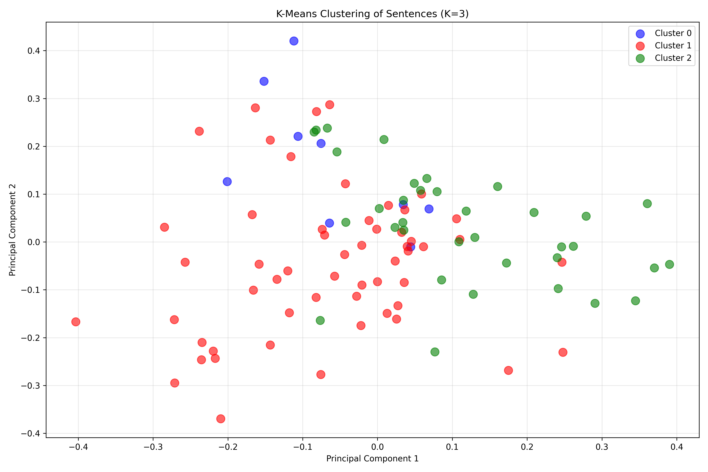

# Sentence Clustering with K-Means and KNN Classification

A Python-based machine learning project that clusters sentences about Mars colonization using K-Means clustering and classifies new sentences using K-Nearest Neighbors (KNN) algorithm. The project visualizes the results in a 2D scatter plot using Principal Component Analysis (PCA).

## Features

- **K-Means Clustering (K=3)**: Groups 100 sentences about Mars colonization into 3 distinct clusters
- **TF-IDF Vectorization**: Converts text sentences into numerical feature vectors
- **KNN Classification (K=5)**: Classifies new sentences based on the 5 nearest neighbors from the training data
- **PCA Dimensionality Reduction**: Reduces high-dimensional TF-IDF vectors to 2D for visualization
- **Interactive Visualization**: Matplotlib scatter plots with color-coded clusters
- **Console Output**: Displays cluster assignments and detailed sentence groupings

## Theory and Solution

### K-Means Clustering

K-Means is an unsupervised learning algorithm that partitions data into K clusters by:
1. Randomly initializing K cluster centroids
2. Assigning each data point to the nearest centroid
3. Recalculating centroids as the mean of assigned points
4. Repeating steps 2-3 until convergence

In this project, K=3 was chosen to group sentences into three categories: pro-colonization, anti-colonization, and neutral/factual statements.

### TF-IDF Vectorization

**TF-IDF (Term Frequency-Inverse Document Frequency)** transforms text into numerical vectors by:
- **Term Frequency (TF)**: Measures how often a word appears in a document
- **Inverse Document Frequency (IDF)**: Reduces the weight of common words that appear across many documents

This creates a feature space where similar sentences (with similar word usage) are positioned closer together.

### K-Nearest Neighbors (KNN) Classification

KNN is a supervised learning algorithm that classifies new data points by:
1. Finding the K nearest neighbors in the training data (using distance metrics)
2. Taking a majority vote among those K neighbors
3. Assigning the most common class label to the new point

In this project, K=5 means each new sentence is classified based on the cluster labels of its 5 most similar sentences from the original dataset.

### Principal Component Analysis (PCA)

PCA is a dimensionality reduction technique that:
- Identifies the directions (principal components) with maximum variance in the data
- Projects high-dimensional data onto these components
- Retains the most important information while reducing dimensions

Here, PCA reduces TF-IDF vectors (hundreds of dimensions) to 2D for visualization while preserving cluster structure.

### Solution Architecture

```
Original Sentences (sentences.json)
         ↓
   TF-IDF Vectorization
         ↓
   K-Means Clustering (K=3)
         ↓
   PCA Reduction to 2D
         ↓
    Visualization

New Sentences (new_sentences.json)
         ↓
   TF-IDF Transform (using same vectorizer)
         ↓
   KNN Classification (K=5)
         ↓
   PCA Transform (using same PCA model)
         ↓
   Visualization (hollow circles)
```

## Installation

### Prerequisites

- Python 3.8 or higher
- `uv` package manager (for virtual environment management)

### Setup Instructions

1. **Clone or navigate to the project directory:**
   ```bash
   cd /path/to/L16
   ```

2. **Create and activate a virtual environment using uv:**
   ```bash
   uv venv
   source .venv/bin/activate  # On Windows: .venv\Scripts\activate
   ```

3. **Install required packages:**
   ```bash
   uv pip install -r requirements.txt
   ```

### Required Dependencies

The project requires the following Python packages (see `requirements.txt`):
- `scikit-learn` - Machine learning algorithms (K-Means, KNN, TF-IDF, PCA)
- `matplotlib` - Data visualization
- `numpy` - Numerical operations

## Usage

### Running the Script

Execute the main script to perform clustering, classification, and visualization:

```bash
python kmeans_clustering.py
```

### Step 1: Clustering Original Sentences

When you run the script, it first loads 100 sentences from `sentences.json` and performs K-Means clustering (K=3). The console displays each cluster with its sentences:

```
================================================================================
CLUSTER 0 (9 sentences)
================================================================================
  - Terraforming Mars might eventually make it a second home for humans.
  - Terraforming Mars might take thousands of years, if possible at all.
  - Mars may not be worth colonizing if it offers no real benefits.
  ...

================================================================================
CLUSTER 1 (55 sentences)
================================================================================
  - Living on Mars would inspire future generations of explorers.
  - Establishing a Mars base would create new industries and jobs.
  ...

================================================================================
CLUSTER 2 (35 sentences)
================================================================================
  - Colonizing Mars would ensure humanity's survival beyond Earth.
  - A Mars colony could drive new technological innovations.
  ...
```

**Interpretation:**
- **Cluster 0**: Sentences containing speculative language ("might", "may")
- **Cluster 1**: Mix of neutral facts and diverse opinions about Mars colonization
- **Cluster 2**: Sentences focused on concrete benefits, risks, and technical aspects

### Step 2: Classifying New Sentences

The script then loads 10 new sentences from `new_sentences.json` and classifies them using KNN (K=5):

```
================================================================================
NEW SENTENCE CLUSTER ASSIGNMENTS (10 sentences)
================================================================================
Cluster 2: Establishing a Mars colony offers humanity a crucial backup plan for long-term species survival.
Cluster 1: The technological advancements required for colonization would spur significant innovation across multiple industries on Earth.
Cluster 1: Mars represents the next great frontier, fulfilling the innate human drive for exploration and expansion.
Cluster 2: Colonization could unlock vast resources and energy currently inaccessible to us, potentially solving shortages on Earth.
Cluster 1: The immense, multi-trillion dollar cost of the endeavor could be better spent resolving critical issues here on Earth.
Cluster 1: Transferring Earth's microbes and potentially harmful organisms risks contaminating the pristine Martian environment.
Cluster 2: The extreme psychological and physical toll on the colonists could lead to unforeseen health and social crises.
Cluster 2: A Mars colony might quickly become an unregulated, libertarian playground, escaping democratic accountability.
Cluster 1: The colonization of Mars hinges on the development of reliable, high-speed, reusable heavy-lift launch systems.
Cluster 1: Future Martian settlers will face challenges related to radiation shielding and in-situ resource utilization (ISRU).
```

**Interpretation:**
Each new sentence is assigned to the cluster whose members are most similar (based on the 5 nearest neighbors). This shows how KNN leverages existing patterns to classify unseen data.

### Step 3: Visualization

The script generates a scatter plot (`clusters_plot.png`) showing:

- **Filled circles**: Original 100 sentences, colored by their K-Means cluster assignment
  - Blue = Cluster 0
  - Red = Cluster 1
  - Green = Cluster 2
- **Hollow circles with thick borders**: 10 new sentences, colored by their KNN-assigned cluster
- **X/Y axes**: First two principal components from PCA



**How to interpret the plot:**
- **Proximity**: Sentences close together have similar word usage and meaning
- **Cluster separation**: Distinct groups indicate different themes or sentiments
- **New sentence placement**: Shows which existing cluster each new sentence most resembles
- **Hollow circles**: Easy visual distinction between training data and new predictions

## Project Structure

```
L16/
├── kmeans_clustering.py      # Main script with all clustering and classification logic
├── sentences.json             # 100 original sentences about Mars colonization
├── new_sentences.json         # 10 new sentences to be classified
├── clusters_plot.png          # Generated visualization (after running script)
├── requirements.txt           # Python package dependencies
├── README.md                  # This file
└── docs/
    └── PROMPTS.md            # Project documentation and prompts
```

## Data Format

### Input Files

Both `sentences.json` and `new_sentences.json` follow the same JSON format:

```json
[
  "First sentence about Mars colonization.",
  "Second sentence with different perspective.",
  "Third sentence containing factual information.",
  ...
]
```

**Requirements:**
- Valid JSON array format
- Each element is a string (sentence)
- Sentences can be of any length
- No preprocessing required (handled by TF-IDF vectorizer)

## Code Overview

### Main Functions

- `load_sentences(filepath)` - Loads sentences from JSON file
- `vectorize_sentences(sentences)` - Converts text to TF-IDF vectors
- `cluster_sentences(vectors, num_clusters)` - Performs K-Means clustering
- `classify_new_sentences(vectors, labels, vectorizer, filepath, k)` - KNN classification
- `reduce_dimensions(vectors)` - PCA transformation to 2D
- `plot_clusters(coords, labels, num_clusters, new_coords, new_labels)` - Visualization
- `group_by_cluster(sentences, labels, num_clusters)` - Groups sentences by cluster
- `display_clusters(clusters)` - Prints clusters to console
- `print_new_sentence_assignments(sentences, labels)` - Prints classifications

### Key Parameters

- **K-Means K=3**: Number of clusters for original sentences
- **KNN K=5**: Number of nearest neighbors for classification
- **PCA n_components=2**: Dimensions for visualization
- **random_state=42**: Ensures reproducible results

## Examples and Use Cases

### Example 1: Understanding Cluster Themes

After running the script, examine the console output to understand what each cluster represents:

```python
# Cluster 0: Speculative/conditional statements
# Cluster 1: Mixed neutral facts and diverse opinions
# Cluster 2: Concrete benefits, risks, and technical aspects
```

### Example 2: Predicting New Sentence Categories

Add your own sentences to `new_sentences.json`:

```json
[
  "Mars colonization could revolutionize space medicine.",
  "The harsh Martian environment poses significant challenges.",
  "Perhaps Mars will become humanity's second home someday."
]
```

Run the script to see which cluster each sentence gets assigned to based on similarity to existing sentences.

### Example 3: Adjusting Cluster Count

Modify the `num_clusters` parameter in `main()` to experiment with different cluster counts:

```python
num_clusters = 5  # Try more granular clustering
```

Note: This will require updating the `colors` list in `plot_clusters()` if K > 3.

## Tips and Recommendations

1. **Consistent Preprocessing**: Both training and new sentences use the same TF-IDF vectorizer, ensuring consistent feature representation
2. **K Selection**: The choice of K=3 for K-Means was based on domain knowledge (pro/anti/neutral stances), but can be optimized using metrics like silhouette score
3. **KNN K Value**: K=5 provides a good balance between local precision and noise reduction
4. **Visualization**: PCA preserves cluster structure well, but some information is lost in dimensionality reduction
5. **Scalability**: TF-IDF and K-Means scale well to larger datasets

## License

This project is for educational purposes.

## Acknowledgments

- Dataset: Custom-created sentences about Mars colonization
- Libraries: scikit-learn, matplotlib, numpy
